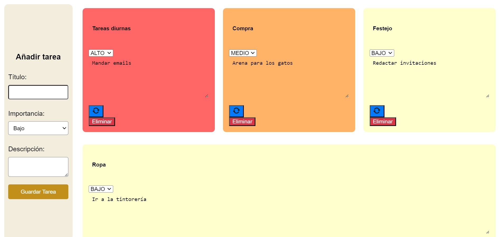

# TO DO TASK - Web App

Este proyecto es una aplicación web de gestión de tareas (TODO) que incluye autenticación de usuarios con login y gestión de tareas individuales para cada usuario. Utiliza tecnologías como HTML, CSS, JavaScript, PHP y MySQL para proporcionar una solución robusta y escalable para la gestión de tareas.

# Índice

1. [Tecnologías utilizadas](#tecnologías-utilizadas)
2. [Características](#características)
3. [Screenshots](#screenshots)
4. [Instrucciones para descargar e instalar la Aplicación Web "TO DO TASK" en un entorno local](#instrucciones-para-descargar-e-instalar-la-aplicación-web-to-do-task-en-un-entorno-local)
5. [Soporte Adicional](#soporte-adicional)

## Tecnologías utilizadas

**Frontend:** HTML, CSS, JavaScript.

**Backend:** PHP.

## Características

- **Autenticación de Usuarios:** Permite a los usuarios registrarse e iniciar sesión.
- **Gestión de Tareas:** Los usuarios pueden crear, ver, actualizar y eliminar sus propias tareas.
- **Interfaz Intuitiva:** Diseño limpio y fácil de usar para una experiencia de usuario óptima.
- **Seguridad:** Implementación de medidas de seguridad para proteger la información de los usuarios y prevenir ataques.

## Screenshots


\*Captura de la pantalla de login/register.


\*Captura de la mesa de tareas.
En esta captura se puede ver que según el valor de importancia de la tarea, la tarjeta que almacena la tarea es de un color u otro para reforzar el mensaje de su valor.

## Instrucciones para descargar e instalar la Aplicación Web "TO DO TASK" en un entorno local:

### Instalar y Configurar XAMPP:

- Descarga e instala XAMPP desde [https://www.apachefriends.org/index.html](https://www.apachefriends.org/index.html) según las instrucciones proporcionadas para tu sistema operativo.
- Inicia los servicios de Apache y MySQL en XAMPP.

### Clonar el Repositorio desde GitHub:

- Abre tu terminal o línea de comandos.
- Ejecuta el siguiente comando para clonar el repositorio en tu máquina, dentro de la carpeta Xampp/htdocs:

```bash
  git clone   hps://github.com/AlejandroGC1990/trabajoFinalCrudPHP.git

```

### Importar la Base de Datos:

- Encuentra el archivo tareas.sql en el repositorio clonado.
- Abre phpMyAdmin accediendo a [http://localhost/phpmyadmin](http://localhost/phpmyadmin) en tu navegador.
- Crea una nueva base de datos llamada tareas.
- Selecciona la base de datos tareas y luego selecciona la opción "Importar".
- Elige el archivo tareas.sql y haz clic en "Ejecutar" para importar la base de datos.

### Configurar la Aplicación:

- Crea un archivo ".env" en la raiz del proyecto para la configuración de la base de datos en el repositorio clonado.
- Actualiza la configuración de la base de datos con tus credenciales.

```bash
  DB_HOST = "localhost";
  DB_USUARIO = "root";
  DB_PASS = "";
  DB_NAME = "tareas";
```

### Ejecutar la Aplicación:

-Abre tu navegador web y accede a http://localhost/trabajoFinalCrudPHP para ver la aplicación web.

-La aplicación debería estar ahora disponible y lista para su uso en tu entorno local.

### Soporte Adicional:

Si encuentras algún problema durante la instalación o configuración, por favor, ponte en contacto conmigo a través de "alejandrogc.dev@gmail.com" para obtener ayuda adicional.

¡Disfruta usando la aplicación "TO DO TASK" en tu entorno local!
